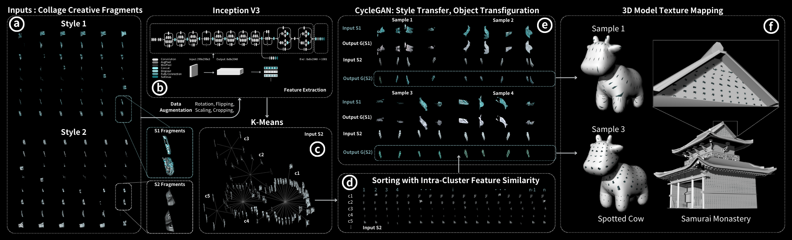
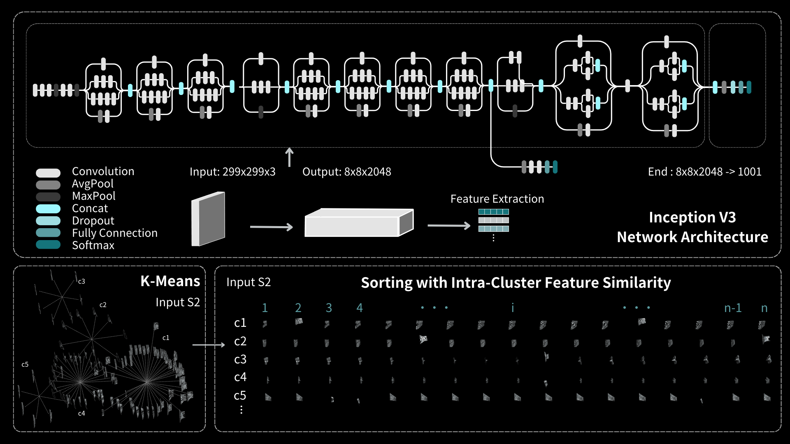
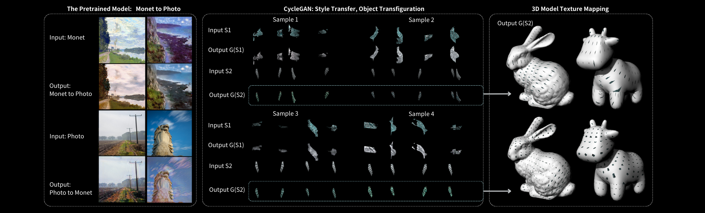
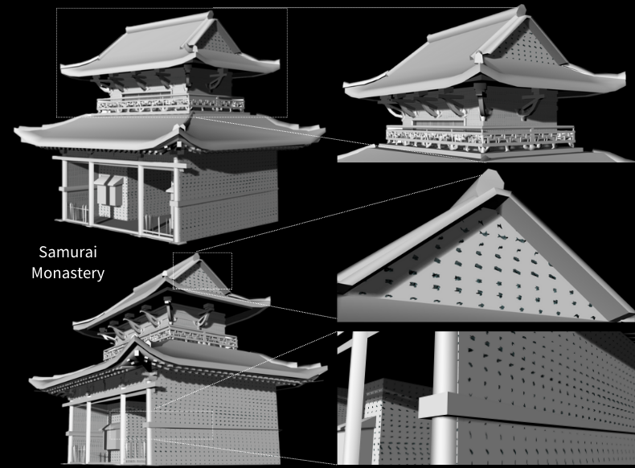

# Visual_Symphonies
### Visual Symphonies: Exploring the Creative Fragments and Textures of Collages on 3D Model Surfaces through Clustering, Image Sorting, and CycleGAN Generation

#### Shih-Yu, Lai

The bottleneck in complex texture mapping stems from limited creative variation while ensuring visual style consistency, resulting in a monotony of visuals and modeling. We present Visual Symphonies, which employs numerous collage creative fragments in two styles for style transfer on texture fragments, enhancing stylistic diversity. Leveraging feature-similar fragments with Inception V3 for feature extraction, K-Means clusters images effectively. Sorting by intra-cluster feature similarity ensures the stylistic uniformity of fragments within the nearby parts of the texture. Enhancing photos with clustering, CycleGAN optimizes fragment generation for style transfer and object transformation, introducing variations in form, geometry, color, and gradation. Finally, applying this tool to read collage textures of 3D models and map them for visualization supports computer-aided design and graphics, including flat printing, 3D textures, craft pattern design, and enriching organic spaces in the architecture with painted tiles and mosaics.

- The Framework of Visual Symphonies: Utilizing (a) collage creative fragments, image feature extraction with (b) Inception V3, and (c) K-Means clustering, we sort images by (d) intra-cluster feature similarity, enhance the generation of (e) CycleGAN for style transfer, and apply it to (f) 3D models for texture mapping and visualization.

- Image feature extraction uses a pre-trained Inception V3 model with data augmentation to enhance fragment features, K-Means clustering groups images by inner style using these features, and intra-cluster sorting arranges images by feature similarity within clusters.

- The image demonstrates a process where Monet paintings and photographs are transformed into stylized fragments by a pre-trained model, these are then reimagined through CycleGAN to transfer styles and reshape objects, and finally, the textures are mapped onto 3D models.

  

- Samurai Monastery is mapped with detailed and stylish fragments, strategically arranged to highlight architectural features and visual complexity.
